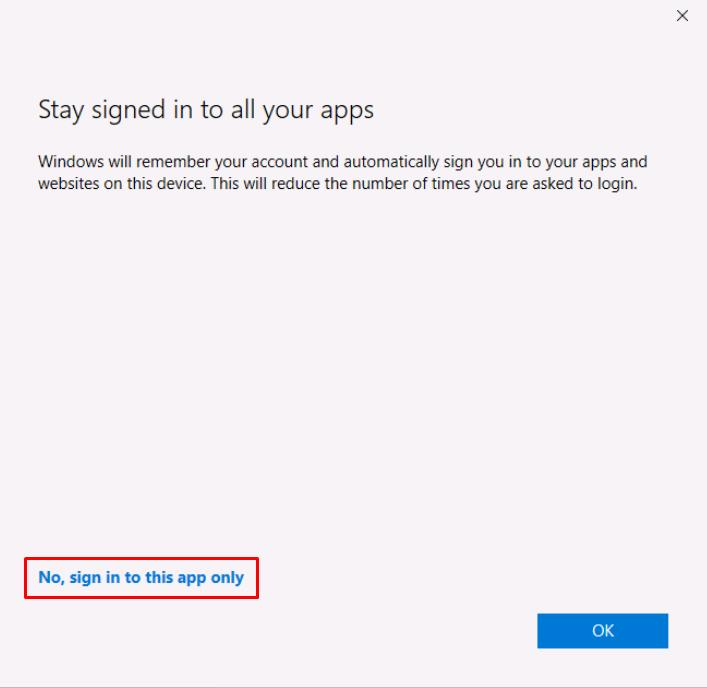
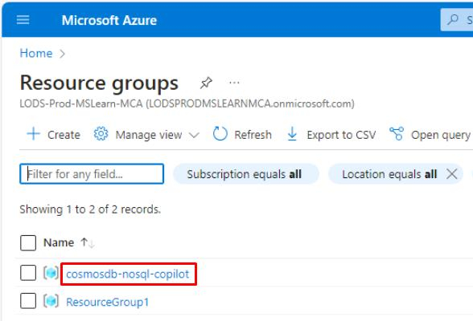
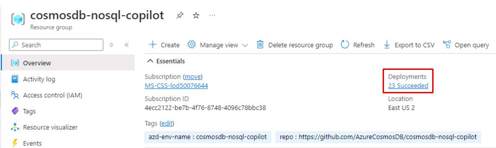
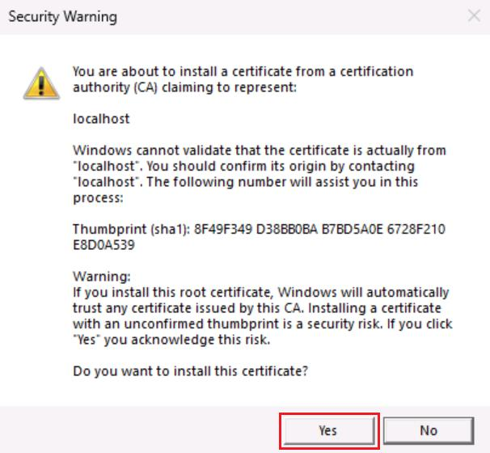
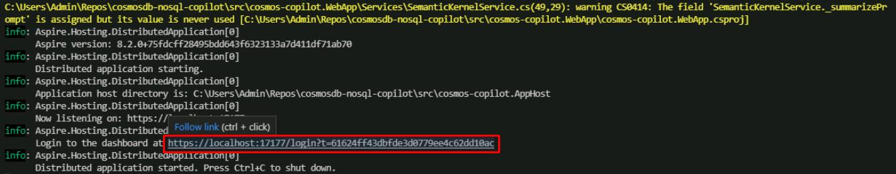
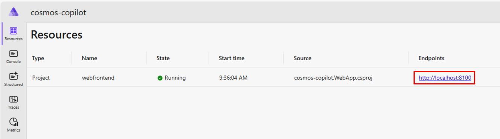
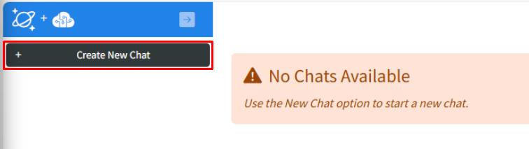
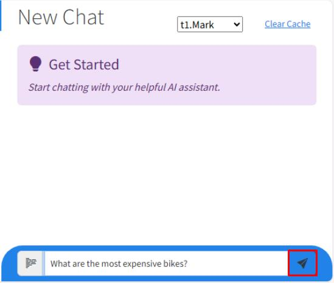
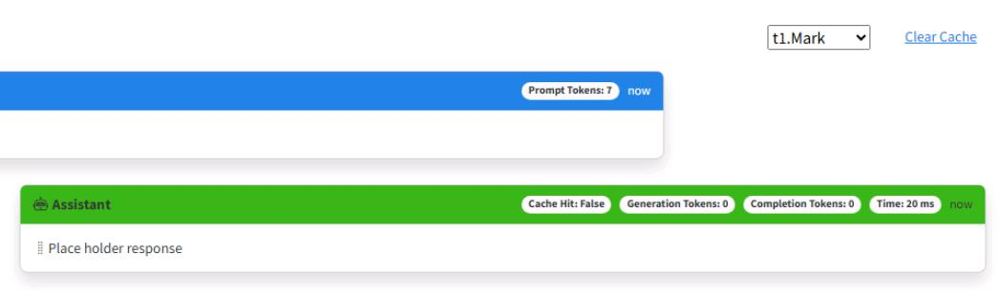

# Task 01: Set up and run the starter web application

## Introduction
Before CWBC’s Intelligent Assistant can help customers with bike-related queries, you need to ensure the foundational environment is properly set up. This lets you confirm everything builds and runs as intended. Think of it as tightening the bolts on a new bike frame before a test ride.

## Description
In this task, you’ll set up authentication, verify your code builds successfully, and run the existing starter application. Once complete, you’ll see a placeholder AI response in the chat UI.

## Success criteria
- You authenticated to Azure, trusted the HTTPS development certificate, and ran the project without encountering any errors.
- You launched the basic chat UI, which displayed a placeholder response in the conversation window.
- You successfully accessed the .NET Aspire dashboard locally, confirming that the app is listening and reachable.


## Learning resources
- [Get started with .NET Aspire](https://devblogs.microsoft.com/dotnet/introducing-dotnet-aspire)  
- [Azure Cosmos DB for NoSQL – Introduction](https://learn.microsoft.com/en-us/azure/cosmos-db/nosql/introduction)  
- [Azure OpenAI Service – Overview](https://learn.microsoft.com/en-us/azure/ai-services/openai/overview)  
- [Authentication with Microsoft Entra ID](https://learn.microsoft.com/en-us/azure/active-directory/develop/authentication-scenarios)  
- [Configure HTTPS for ASP.NET Core](https://learn.microsoft.com/en-us/aspnet/core/security/enforcing-ssl)  
- [Understanding .NET Aspire Orchestration](https://devblogs.microsoft.com/dotnet/introducing-dotnet-aspire-for-ai-cloud-native-apps)  

## Key tasks


### 01: Configure authentication

<details markdown="block"> 
  <summary><strong>Expand this section to view the solution</strong></summary> 

CWBC values a secure-by-design approach—especially as the Intelligent Assistant will store private user data, product catalogs, and ride recommendations in Azure Cosmos DB. Proper authentication ensures only authorized personnel and processes can access these resources.

<!-- 1. @lab.Activity(Automated3) -->

1. On your Windows task bar, select **Terminal**.

1. Change the current working directory to where the application repository was cloned.

    ```
    cd C:\Users\Admin\Repos\cosmosdb-nosql-copilot
    ```

    {: .highlight }
    > Using the **Copy** option and selecting **Ctrl+V** to paste into the VM will be faster than using **Text** for Type Text. This will be more useful later on with long blocks of code.

1. Open the project in Visual Studio Code with the following command.

    ```
    code .
    ```

1. Within Visual Studio Code, open a new terminal by selecting **Terminal** on the top toolbar, then selecting **New Terminal**. Alternatively, select **Ctrl+Shift+**.


### Sign in to Azure

To access the Azure resources, you need to be authenticated from the terminal in Visual Studio Code. This application uses authentication with [Microsoft Entra ID](https://learn.microsoft.com/entra/identity/). Role assignments have already been created for your user during resource deployment. 

<!-- If you're already signed in with the user credentials you used for deployment, skip to [Build and run the application for the first time.](#build-and-run-the-application-for-the-first-time) -->

1. Sign in to the Azure CLI by entering the following command in the terminal window inside of Visual Studio Code.

    ```
    az login
    ```

1. Select **Work or school account**, then select **Continue**.

    {: .warning }
    > The sign in window may open behind Visual Studio Code.

1. Sign in with your credentials.

1. Select **No, sign in to this app only**, when prompted.

    

1. In the Visual Studio Code Terminal, enter **1** to select your subscription and tenant.

---

### Grant Azure permissions to your account

Before you can run the applications locally within the security context of your Azure user you need to ensure it has permissions to the data in Azure Cosmos DB account and the endpoints of Azure Open AI account.  

1. Within Visual Studio Code terminal and change the current working directory to the scripts folder of this application.

    ```
    cd ~/Repos/cosmosdb-nosql-copilot/infra/scripts
    ```

1. Open Microsoft Edge, go to [Azure portal](https://portal.azure.com), then sign in with your credentials:

    | Item | Value |
    |:--------|:--------|
    | Username   | Azure user name   |
    | Password  | Azure password   |

1. Expand the service menu on the left, then select **Resource Groups**.

    

1. Select **cosmosdb-nosql-copilot**.

    

1. On the resource group page, verify all the deployments have **Succeeded** under the **Deployments** property before proceeding forward.

    

    {: .warning }
    > If it's still deploying, wait until it's complete.

1. Close the browser window.

1. Go to your Visual Studio Code terminal, then run the **azd-role-assignments.sh** script to grant permissions to your Azure user account.

    ```
    ./azd-role-assignments.sh
    ```

    {: .note }
    > You can open the file in Visual Studio Code to see how this was written.
</details>


### 02: Build and run the application for the first time

<details markdown="block"> 
  <summary><strong>Expand this section to view the solution</strong></summary> 

CWBC wants to verify the project scaffolding is sound before introducing the real AI features.
Now that authentication is in place, you can run the initial version of the Intelligent Assistant to confirm everything compiles and the UI functions. 

1. In the same terminal, change directories to **src/cosmos-copilot.AppHost**. 

    ```
    cd ~/Repos/cosmosdb-nosql-copilot/src/cosmos-copilot.AppHost
    ```

    {: . important }
    > The **AppHost** is the entry point for all .NET Aspire projects and it acts as an orchestrator for all the dependent projects and services in your application.

1. Before you run the application locally, you need to trust the https developer certificate that .NET will generate.

    ```
    dotnet dev-certs https --clean
    dotnet dev-certs https --trust
    ```

1. In the **Security Warning** dialog to install certificate, select **Yes**.

    

1. At this point, your app has enough information to run but not enough to generate a real response from an LLM. Run the application to make sure your code doesn't have any omissions or errors.

    ```
    dotnet workload restore
    dotnet run
    ```

    {: .note }
    > You may see some warnings in the terminal which are safe to ignore.

1. To test your application, launch the .NET Aspire dashboard by selecting **Ctrl+click** on the URL on the **Login to the dashboard** line.

    

    {: .note }
    > This will automatically open the .NET Aspire dashboard in a web browser.
    >
    > The .NET Aspire dashboard has pages to manage all project resources, view console output, structured logs, traces for each request, and metrics emitted by various libraries. 

    {: .warning }
    > If you get a "Your connection isn't private" message on the web browser, close all browser windows, then select **Ctrl+click** on the dashboard URL again.

1. On the dashboard, launch your chat application by selecting the **http://localhost:8100** endpoint.

    

1. Select **Create new chat** on the left side.

    

1. Enter **What are the most expensive bikes?**, then select the send button.

    

    {: .note }
    > The AI assistant will respond with **"Place holder response"** and a token value of zero. Tokens will be explained in a later exercise.

    

1. Close the browser window.

1. In the Visual Studio Code terminal, select **Ctrl+C** to shut down the application. Leave the terminal open.

{: .note }
> Every time you run the application locally, do it from the **src/cosmos-copilot.AppHost** directory you are already in. All updates to the application will be to files in the **src/cosmos-copilot.WebApp** directory and its folders.
---
**Congratulations!** You've successfully completed this task.
</details>


