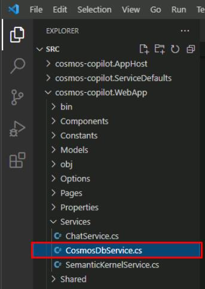
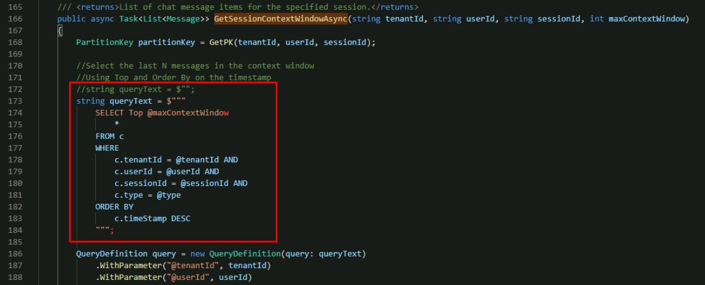
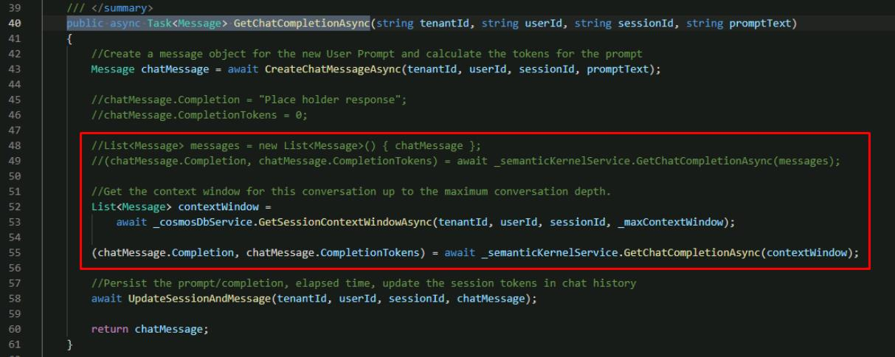
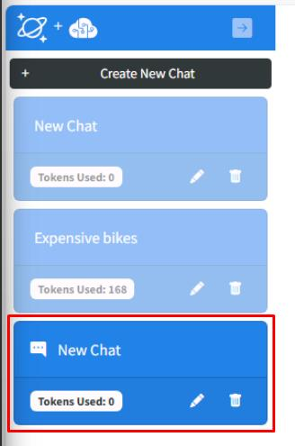
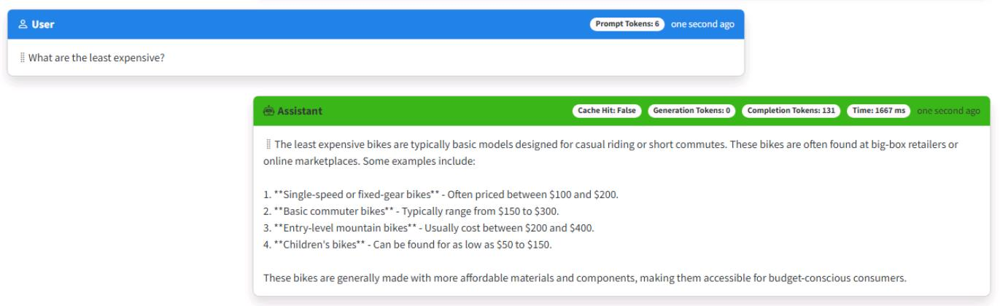

 # Task 03: Implement Chat History (Context Window)

### Introduction
 A big objective for Boulder is creating a “conversational infotainment system.” That means remembering prior user inputs—like recent route selections—so follow-up queries feel natural. Implementing a context window Customers rarely ask just one question. A rider might ask about “e-bikes for commuting,” then follow up with “Which has the longest battery range?” For the conversation to feel seamless, your Intelligent Assistant must remember what the user already asked. This is where your context window comes in—like building a memory into the bike’s onboard computer.
 

### Description
 You have the basics for our generative AI application now in place. Next, you can further test and explore how well it responds to natural language interactions.

### Success Criteria
 - The Intelligent Assistant “remembers” previous user prompts, enabling follow-up questions to reference earlier context.
 - You have logic in place (e.g., a max context window) so the AI doesn’t exceed token limits or slow down.
 - When you ask a second question, the answer reflects details from your first question—proving context is working.

### Learning Resources
 - TBD

### Key Tasks
 - 01: Test contextual follow-up questions
 - 02: Building a context window using tokens
 - 03: Check your work

---

 
 ## 01: Test contextual follow-up questions
 
<details markdown="block"> 
  <summary><strong>Expand this section to view the solution</strong></summary> 

 Before adding chat history, a second question won’t reference the first, leaving the user confused. Seeing that failure helps you appreciate why CWBC insisted on multi-turn conversations—no one wants to repeat themselves.
 
 Let's explore what happens when you test contextual follow-up questions with our LLM by asking follow-up questions that imply an existing context, like you would have in a conversation with another person.
 
 1. In the same chat session as the previous task, enter: **What are the least expensive?**
 
     {: .note }
     > The response generated will either have nothing to do with your first question, or the LLM may respond that it needs more context to give you an answer.
     >
     > This demonstrates that LLM's are stateless. They don’t maintain any conversation history by themselves and are missing the context necessary for the LLM to respond appropriately to your second question.
 
 1. Close the web browser and end the process in the terminal by selecting **Ctrl+C**.
 
 
 
 ## Tokens in Large Language Models
 
 In this exercise, you'll implement chat history, often called a **Context Window** for a generative AI application. Before you write the code, we need to explain the concept of tokens for an LLM and why these are important to consider when implementing a context window.
 
 LLMs require chat history to generate contextually relevant results, but they have limits on how much text they can process in a request, and output in a response. These limits are not expressed as words, but as **tokens**. Tokens represent words or part of a word. On average 4 characters is one token. Tokens are essentially the compute currency for a large language model.
 
 It’s necessary to manage the usage of tokens within your app to stay within the LLM's limits. This can be a bit tricky in certain scenarios. You need to provide enough context for the LLM to generate a correct response, while avoiding negative results of consuming too many tokens such as getting incomplete results or unexpected behavior.
 
 To limit the maximum amount of chat history (and text) we send to our LLM, we’ll count the number of user prompts we send to the LLM as context. This app uses a variable **_maxContextWindow** to manage the limit for each request.
 
 </details>
 
 ## 02: Building a context window using tokens
 
<details markdown="block"> 
  <summary><strong>Expand this section to view the solution</strong></summary> 

 You’ll store recent messages but also mind the token limit. CWBC can’t afford slow, bloated requests. Striking a balance ensures your Intelligent Assistant remembers enough about the conversation without bogging down performance.
 
 In this task, you'll implement the **GetSessionContextWindowAsync()** function in the **Services/CosmosDbService.cs** class to build our chat history.
 
 1. In VS Code, on the left **EXPLORER** pane, open **CosmosDbService.cs** from the same **Services** subfolder as the previous files you modified.
 
     
 
 1. Within the **CosmosDbService.cs** class, select **Ctrl+F** to find the **GetSessionContextWindowAsync`()** method with the following signature:
 
     ```csharp
     public async Task<List<Message>> GetSessionContextWindowAsync(string tenantId, string userId, string sessionId, int maxContextWindow)
     ```
 
 1. Comment out the placeholder **string queryText** in this function and add a query, with the following:
 
     ```csharp
     //string queryText = $"";
     string queryText = $"""
         SELECT Top @maxContextWindow
             *
         FROM c  
         WHERE 
             c.tenantId = @tenantId AND 
             c.userId = @userId AND
             c.sessionId = @sessionId AND 
             c.type = @type
         ORDER BY 
             c.timeStamp DESC
         """;
     ```
 
     
 
     {: .note }
    > This selects the most recent number of messages in the chat session depending on the **maxContextWindow** variable.
     >
     >After querying for the most recent messages in Azure Cosmos DB, we put them back in order in reverse. The most recent text is what we want closer to the actual question. Counting the number of messages allows us to control the total number of tokens used while still providing relevant context.
 
 1. Save the **CosmosDbService.cs** file.
 
 1. Go back to the **ChatService.cs** file.
 
 1. Find the **public async Task<Message> GetChatCompletionAsync** line. 
 
 1. Use the following to replace the two lines initializing the **List<Message> messages** variable and passing it to the Semantic Kernel service:
 
     ```csharp
     //List<Message> messages = new List<Message>() { chatMessage };
     //(chatMessage.Completion, chatMessage.CompletionTokens) = await _semanticKernelService.GetChatCompletionAsync(messages);
 
     //Get the context window for this conversation up to the maximum conversation depth.
     List<Message> contextWindow = 
         await _cosmosDbService.GetSessionContextWindowAsync(tenantId, userId, sessionId, _maxContextWindow);
 
     (chatMessage.Completion, chatMessage.CompletionTokens) = await _semanticKernelService.GetChatCompletionAsync(contextWindow);
     ```
 
     
 
     {: .note }
    > This calls the function to get the context window that you just updated, and passes the context window to the Semantic Kernel Service to get a completion from Azure OpenAI.
     >
     > You're now passing in a list of messages that represents the conversation history to get our contextually relevant completion. You implemented **GetChatCompletionAsync()** to take a list of prompts, rather than a single prompt representing the current user message alone.
 
 1. Save the **ChatService.cs** file.
 
</details>
 
 ## 03: Check your work
 
<details markdown="block"> 
  <summary><strong>Expand this section to view the solution</strong></summary> 

 A test ride with two or three related questions reveals whether the system can keep track. If it references the first question when answering the second, you know chat history is working—just as CWBC envisioned for a smooth user experience.
 You’re now ready to test your context window implementation.
 
 1. In the terminal, start the application:
 
     ```
     dotnet run
     ```
 
 1. **Ctrl+click** the URL on the **Login to the dashboard** line.
 
 1. Select the **http://localhost:8100** endpoint to start the chat application.
 
 1. Select **Create New Chat** on the left, then select the **New Chat** tile that was created.
 
     
 
 1. Enter **What are the most expensive bikes?**
     
 1. Enter **What are the least expensive?** as a follow-up.
 
     {: .note }
     > You should now see appropriate output similar to the following.
 
     
 
 1. Close the browser.
 
 1. End the process in the terminal by selecting **Ctrl+C**.

 1. Review the **GetChatCompletionAsync** method of the **ChatService.cs** code file to make sure that your code matches this sample.
  
     ```csharp
     public async Task<Message> GetChatCompletionAsync(string tenantId, string userId, string sessionId, string promptText)
     {
        //Create a message object for the new user prompt and calculate the tokens for the prompt
         Message chatMessage = await CreateChatMessageAsync(tenantId, userId, sessionId, promptText);
 
         //Get the context window for this conversation up to the maximum conversation depth.
         List<Message> contextWindow = 
             await _cosmosDbService.GetSessionContextWindowAsync(tenantId, userId, sessionId, _maxContextWindow);
 
         (chatMessage.Completion, chatMessage.CompletionTokens) = await _semanticKernelService.GetChatCompletionAsync(sessionId, contextWindow);
 
         await UpdateSessionAndMessage(tenantId, userId, sessionId, chatMessage);
 
         return chatMessage;
     }
     ```
 </details>
 
 
 
 Congratulations, you completed this task!