# Task 05: Implement a semantic cache

### Introduction
Large language models are amazing with their ability to generate completions to a user's questions. However, these requests to generate completions from an LLM are computationally expensive (expressed in tokens) and can also be quite slow. The cost and latency increase as the amount of text increases. 
 
 Applications following the RAG Pattern use data from a database to augment or *ground* the LLM by providing additional information to generate a more contextual response. Payloads now must include the user prompt, conversation history, and additional data from the database, which can get rather large. It’s not uncommon to consume thousands of tokens and wait for 5 or more seconds for a response for large payloads. In a world where milliseconds count, waiting several seconds is often an unacceptable user experience.
 
 Thankfully, we can create a cache for this type of solution to reduce both cost and latency for repeated prompts. In this exercise, you’ll introduce a specialized cache called a **semantic cache**. Traditional caches are key-value pairs and use an equality match on the key to *get* data. Keys for a semantic cache are vectors (or embeddings) which represent words in a high dimensional space where words with similar meaning or intent are in close proximity to each other dimensionally.

  A cache **GET** is done with a specialized **vector query** comparing the proximity of these vectors to find matches. The results are the cached completions previously generated by an LLM and a **similarity score** that represents how close the vectors are to each other. Similarity values range from **0** (no similarity) to **1** (exact match). 
 
 To execute a vector query for a semantic cache, user text is converted into vectors and then used as the filter predicate to search for similar vectors in the cache. For our semantic cache, you’ll create a query that returns just one result, and the similarity score helps dial in how close the user's intent and words are to the cache's key values. The greater the score, the more similar the words and intent. The lower the score, the less similar the words *and potentially* intent as well.
 
 In practice, setting this value can be tricky. Too high, and the cache will fill up with multiple responses for very similar questions. Too low, and the cache will return irrelevant responses that do not satisfy the user.


### Description
In this exercise, you will implement a semantic cache to optimize response times and reduce AI computation for repeated or similar user queries. You will store previous prompts and generated answers as vector embeddings in a dedicated collection, configure a similarity threshold for retrieving relevant cached entries, and validate that repeated or closely matching queries are served from the cache without re-calling the LLM.

### Success Criteria
 - Repeated or similar questions result in a cache hit, returning an answer without re-calling the LLM.
 - You see fewer calls to Azure OpenAI (and thus fewer tokens consumed) for repeated queries in the logs.
 - You experience near-instant answers once an identical or closely similar query has been asked before.


### Learning Resources
 - TBD

## Key Tasks

 
### 01: Build a semantic cache
 
<details markdown="block"> 
  <summary><strong>Expand this section to view the solution</strong></summary> 

 By saving user queries and completions as embeddings, you enable quick lookups for near-duplicate questions. For CWBC, this means faster answers about top-selling bikes or route suggestions, plus drastically lower cloud usage costs.
 Let's build our semantic cache using Azure Cosmos DB for NoSQL.
 
 1. Open the **CosmosDbService.cs** class file. 
 
 1. Find the function called **GetCacheAsync`()** with the signature below.
 
     ```csharp
     public async Task<string> GetCacheAsync(floatvectors, double similarityScore)
     ```
     
 1. Comment out the empty **string queryText** and replace it with the vector search query, using the following:
 
     ```csharp
     //string queryText = $"";
     string queryText = $"""
     SELECT Top 1 
         c.prompt, c.completion, VectorDistance(c.vectors, @vectors) as similarityScore
     FROM c  
     WHERE 
         VectorDistance(c.vectors, @vectors) > @similarityScore 
     ORDER BY 
         VectorDistance(c.vectors, @vectors)
     """;
     ```
 
     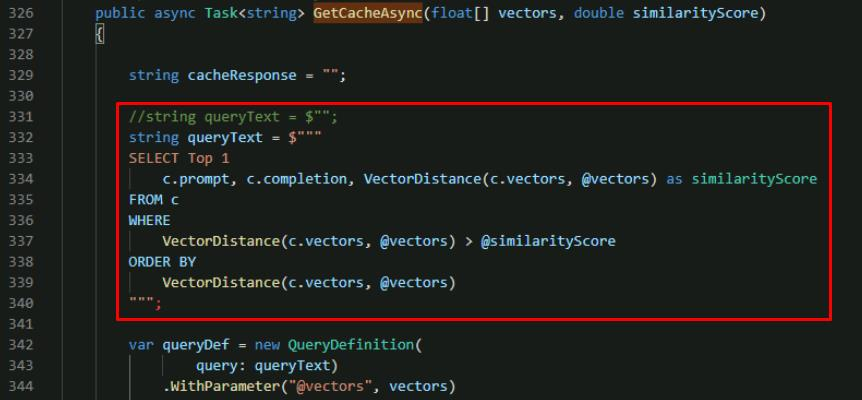
 
     {: .note }
    > This query performs the search to find relevant items in our semantic cache. It selects only the closest match with an **ORDER BY**, so the item with the highest similarity score (and most similar to what is being searched) appears first. The results include a previously cached completion, and the similarity score for the cached item.
 
 1. Save **CosmosDbService.cs**.
 
 1. Open **ChatService.cs**. You'll need to call the **GetCacheAsync()** function from the LLM pipeline. 
 
 1. Find the **public async Task<Message> GetChatCompletionAsync`()** function.
 
     {: .note }
     > You’ll modify this function to search our semantic cache for user prompts with a similar intent to what is being asked. If we find a match, we can return the cached value to the user instead of making a new request to the LLM.
 
 1. Below the existing **promptVectors** declaration in the function, add a call to the **GetCacheAsync()** function that you just updated. **promptVectors** is included in the code block.
 
     ```csharp
     //Generate embeddings for the user prompts for search
     floatpromptVectors = await _semanticKernelService.GetEmbeddingsAsync(prompts);
 
     //Perform a cache search for the same sequence and depth of prompts in this conversation
     string cacheResponse = await _cosmosDbService.GetCacheAsync(promptVectors, _cacheSimilarityScore);
     ```
 
     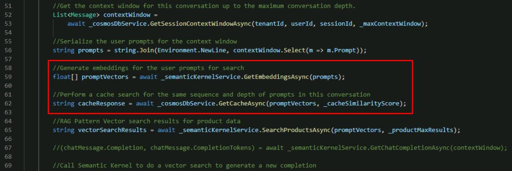
 
     {: .note }
     > To query our cache for past responses to similar prompts, you execute the vector search. 
 
 1. Below the call you just added with **cacheResponse**, add the following: 
 
     ```csharp
     //Cache hit, return the cached completion
     if (!string.IsNullOrEmpty(cacheResponse))
     {
         chatMessage.CacheHit = true;
         chatMessage.Completion = cacheResponse;
 
     //Persist the prompt/completion, elapsed time, update the session tokens
         await UpdateSessionAndMessage(tenantId, userId, sessionId, chatMessage);
         return chatMessage;
     }
     ```
 
     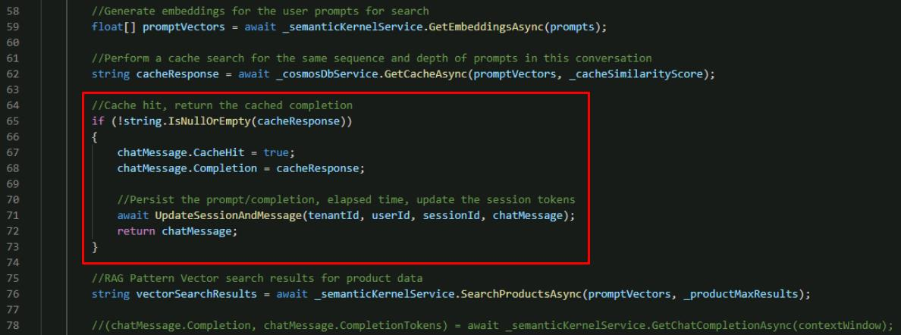
 
     {: .note }
     > If **cacheResponse** is populated, that means it found a matching response to give the user and can skip the rest of the function and return the cached completion. If there wasn't a cache hit, this **if** statement is skipped and the rest of the LLM pipeline is executed to search for relevant products and generate a new completion using the Semantic Kernel Service.
     
 1. Below the existing call to **GetRagCompletionAsync`()**, add a call to update the cache. **GetRagCompletionAsync** is included in the code block.
 
     ```csharp
     //Call Semantic Kernel to generate a new completion
     (chatMessage.Completion, chatMessage.GenerationTokens, chatMessage.CompletionTokens) = 
         await _semanticKernelService.GetRagCompletionAsync(contextWindow, vectorSearchResults);
 
     //Cache the prompts in the current context window and their vectors with the generated completion
     await _cosmosDbService.CachePutAsync(new CacheItem(promptVectors, prompts, chatMessage.Completion));
     ```
 
     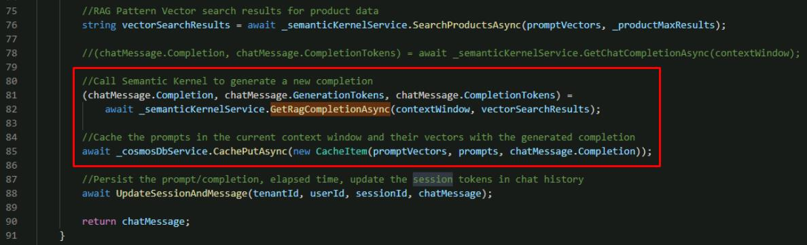
 
     {: .note }
     > This updates the function to store new prompts and completions in the cache to use in the future.
 
 1. Save the **ChatService.cs** file.
 
 
### Check your work
 
Before you test our new semantic cache, verify your code is correct. Select "Compare your code against this example" to check if your code is correct.
 
Compare your code against this example.
 
  
 1. Review the **GetChatCompletionAsync()** method of the **ChatService.cs** code file to make sure that your code matches this sample.
  
     ```csharp
     public async Task<Message> GetChatCompletionAsync(string tenantId, string userId, string sessionId, string promptText)
     {
         //Create a message object for the new User Prompt and calculate the tokens for the prompt
         Message chatMessage = await CreateChatMessageAsync(tenantId, userId, sessionId, promptText);
         
         //Get the context window for this conversation up to the maximum conversation depth
         List<Message> contextWindow = 
             await _cosmosDbService.GetSessionContextWindowAsync(tenantId, userId, sessionId, _maxContextWindow);
 
         //Serialize the user prompts for the context window
         string prompts = string.Join(Environment.NewLine, contextWindow.Select(m => m.Prompt));
 
         //Generate embeddings for the user prompts for search
         floatpromptVectors = await _semanticKernelService.GetEmbeddingsAsync(prompts);
 
         //Perform a cache search for the same sequence and depth of prompts in this conversation
         string cacheResponse = await _cosmosDbService.GetCacheAsync(promptVectors, _cacheSimilarityScore);
 
         //Cache hit, return the cached completion
         if (!string.IsNullOrEmpty(cacheResponse))
         {
            chatMessage.CacheHit = true;
            chatMessage.Completion = cacheResponse;
 
            //Persist the prompt/completion, elapsed time, update the session tokens
            await UpdateSessionAndMessage(tenantId, userId, sessionId, chatMessage);
 
            return chatMessage;
         }
 
         //RAG Pattern Vector search results for product data
         string vectorSearchResults = await _semanticKernelService.SearchProductsAsync(promptVectors, _productMaxResults);
 
         //Call Semantic Kernel to generate a new completion
         (chatMessage.Completion, chatMessage.GenerationTokens, chatMessage.CompletionTokens) = 
             await _semanticKernelService.GetRagCompletionAsync(contextWindow, vectorSearchResults);
 
         //Cache the prompts in the current context window and their vectors with the generated completion
         await _cosmosDbService.CachePutAsync(new CacheItem(promptVectors, prompts, chatMessage.Completion));
 
         //Persist the prompt/completion, elapsed time, update the session tokens in chat history
         await UpdateSessionAndMessage(tenantId, userId, sessionId, chatMessage);
 
         return chatMessage;
     }
     ```
 </details>
 
 
### 02: Tune the cache
 
 <details markdown="block"> 
  <summary><strong>Expand this section to view the solution</strong></summary> 
  
 Setting the right similarity threshold is like adjusting the tension on a bike’s chain — you don’t want it too loose or too tight. CWBC needs to experiment with different similarity scores so the cache is both accurate and efficient.
 At this point, you've implemented our semantic cache and are ready to test.
 
 1. In the VS Code terminal, start the application.
 
     ```
     dotnet run
     ```
 
 1. **Ctrl+click** the URL on the **Login to the dashboard** line.
 
 1. Select the **http://localhost:8100** endpoint.
 
 1. Select **Create New Chat** on the left, then select the **New Chat** that was created.
 
 1. Enter **What are the most expensive bikes?**
 
     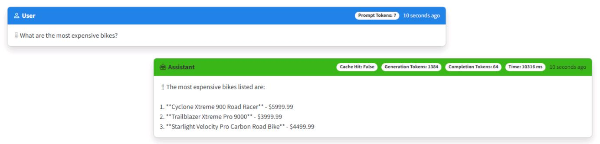
 
     {: .warning }
     > It's okay if you see different results or if the answers are factually inaccurate. Just ensure the flow of questions is the same, and that responses provide bikes from the product catalog.
 
 1. Enter **What are the least expensive?** as a follow-up.
 
     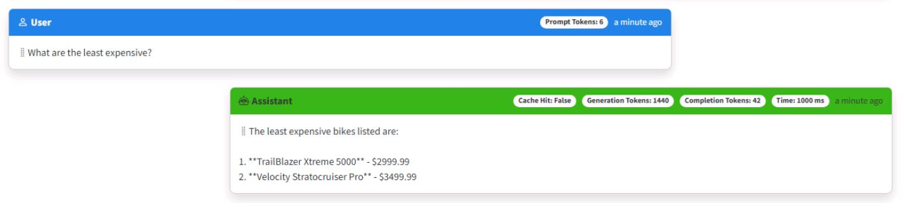
 
 1. Enter **What's a good mid range?**
 
     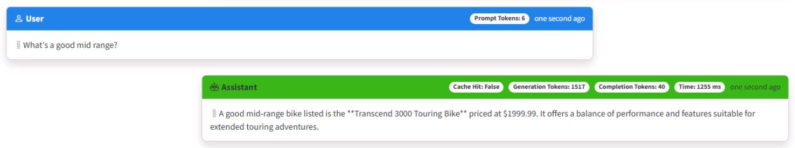
 
 
### Validate semantic cache is working
 
 You’ll know the cache worked if you see a faster response time with no tokens consumed. They'll also have a **Cache Hit: True** tag appended in the upper right of the response. 
 
 To test, you’ll repeat the above sequence with slightly modified prompts, then take the opportunity to adjust the similarity score to see its impact on how the cache works. You’ll start with a very strict similarity score of **0.99**, which is the default for this project, then adjust it after some testing.
 
 <!--  -->
 
 1. Select **Create New Chat** on the left, then select the **New Chat** that was created.
 
 1. Enter a variation of the original question: **What are the highest cost bikes?**
 
     {: .note }
     > Note the chatbot responds correctly, but **does not** hit the cache, and consumes tokens.
 
     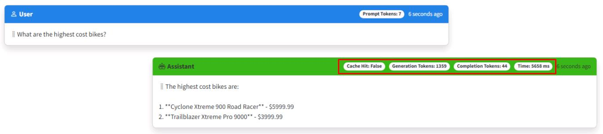
 
 1. Close the web browser.
 
 1. Stop the application from the terminal by selecting **Ctrl+C**.
 
 1. In the **ChatService.cs** file, find the **public ChatService`()** constructor. 
 
 1. Use the following to comment out the _cacheSimilarityScore line parsing the similarity score from our settings, and adjust the value from `0.99` to `0.8`. 
 
     ```csharp
     //_cacheSimilarityScore = Double.TryParse(cacheSimilarityScore, out _cacheSimilarityScore) ? _cacheSimilarityScore : 0.99;
     _cacheSimilarityScore = .8;
     ```
 
     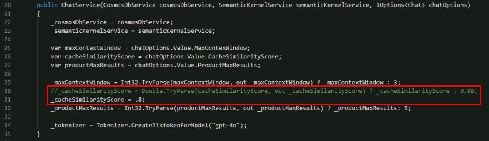
 
 1. Save the **ChatService.cs** file.
 
 1. In the terminal, start the application again. 
 
     ```
     dotnet run
     ```
 
 1. **Ctrl+click** the URL on the **Login to the dashboard** line.
 
 1. Select the **http://localhost:8100** endpoint.
 
 1. Select **Create New Chat** on the left, then select the **New Chat** that was created.
 
 1. Enter **What are the highest cost bikes?** again.
 
     {: .note }
     > This time zero tokens will be used, and the **Cache Hit: True** tag will appended to the response. The response should generally be much faster, as well.
 
     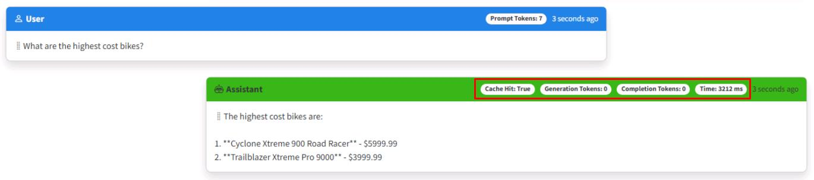
 
 1. Spend a few minutes trying different sequences of questions and follow-up questions and modifying them with different similarity scores. If you want to start over and do multiple tests using the same series of questions, you can select **Clear Cache** in the upper right corner of the app to empty the cache.
 
     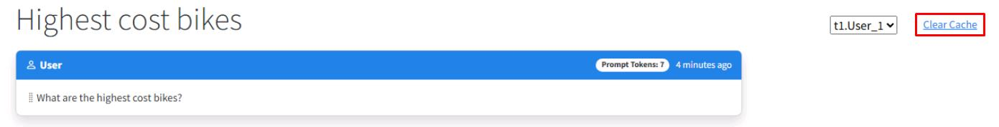
 
 <!-- 1. When you’re done, close the browser.
 
 1. Stop the application from the terminal by selecting **Ctrl+C**. -->
 

### A semantic cache needs to have context
 
 If you haven't noticed by now, the semantic cache in this lab caches within the **context window** for a session. This is different from how traditional caches work. 
 
 Just as you saw earlier in the lab, context matters! Caching a conversation ensures that what gets returned from the cache is contextually correct. If the cache didn't do this, users would get unexpected, and likely unacceptable responses.
 
 Here’s a simple mental exercise for a semantic cache that **does not** cache the context window. 
 
 If you first ask an LLM, "What is the most expensive bike?", it will respond, then cache that user prompt and completion. If you then ask, "What is the least expensive?", the context window you built earlier will pass the chat history to the LLM and it will correctly respond with cheap bikes. The cache will store that individual user prompt and completion too.
 
 Now, say another user in a different session asked, "What is the most expensive **bike seat**?", the LLM will respond with expensive bike seat options. If that user then asked, "What is the least expensive?", the cache will return a list of **bikes** from its cached completion, which of course is not what the user was looking for when they asked about bike seats.
 
 This demonstrates why a semantic cache must cache within a context window. The context window already provides contextual relevance for an LLM to generate completions. This makes it a logical choice for how the cache should work. Implementing this is simple because you're already managing chat history for the app. You just send all the user prompts as a string to be vectorized, then store this with the completion that gets generated by the LLM. Then, when a user comes along later, only those with the **same sequence of questions** within their context window will get that specific cached response.

 </details>

 Congratulations, you completed this task!
